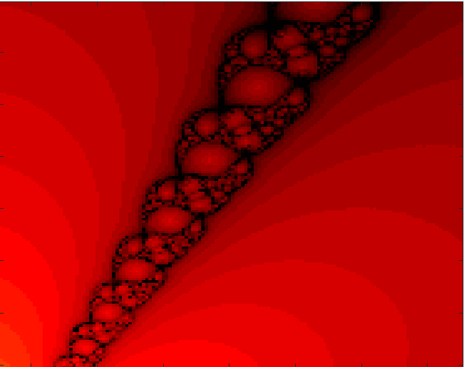

# Newton's method visualization in MATLAB

This project focuses on the visualization of the convergence speed of Newton’s method in the complex domain. The method is applied to finding zeros of a polynomial expressed using Chebyshev polynomials:

$w_n(x) = \sum_{k=0}^{n} a_k \bigl(T_k(x) + U_k(x)\bigr)$

where:
- $T_k(x)$ — Chebyshev polynomial of the first kind
- $U_k(x)$ — Chebyshev polynomial of the second kind

It was developed as part of the *Numerical Methods* course at Warsaw University of Technology.

The implementation is written in MATLAB and includes numerical evaluation of the polynomial and its derivative using recurrence relations, without transforming the polynomial into its natural (expanded) form. Newton’s iterative method is then applied for a grid of initial points in the complex plane.

The results are visualized as images illustrating the convergence behavior of the method, including the number of iterations required to reach a root and the attraction regions of individual zeros. The project also contains test scripts and helper functions used to verify correctness and analyze the performance of the algorithm.

## Numerical error analysis

Numerical errors were analyzed by comparing roots obtained using Newton’s method with reference roots computed in Wolfram Alpha. Absolute errors were visualized using a color scale, where brighter yellow indicates larger errors and darker green represents smaller errors.

   
   

## Interesting examples

   
   

